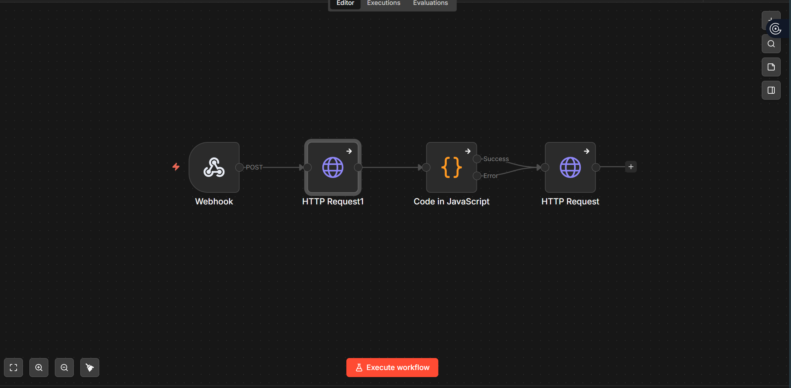
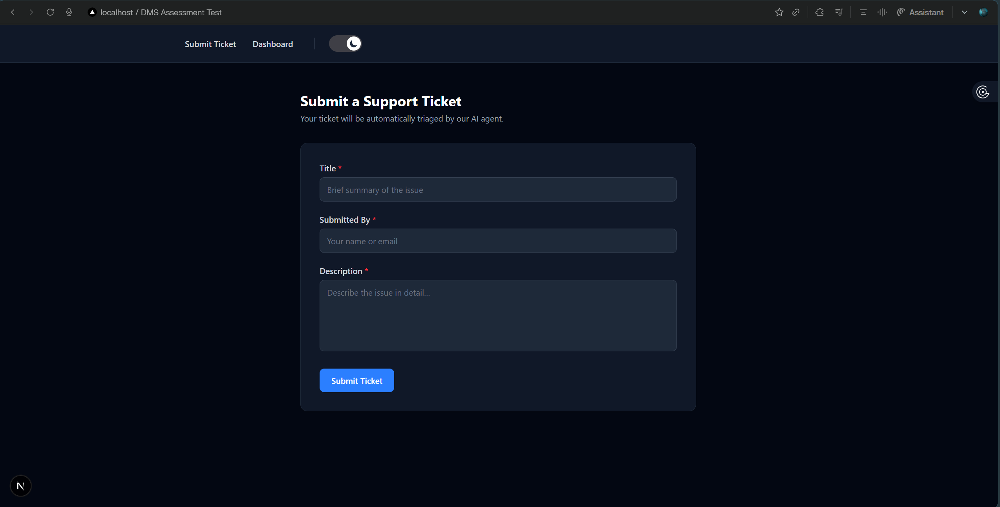
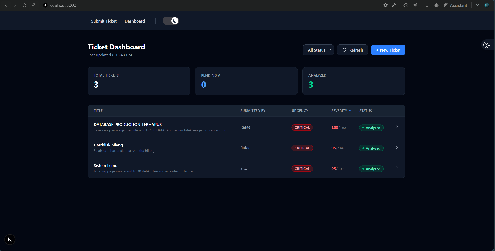
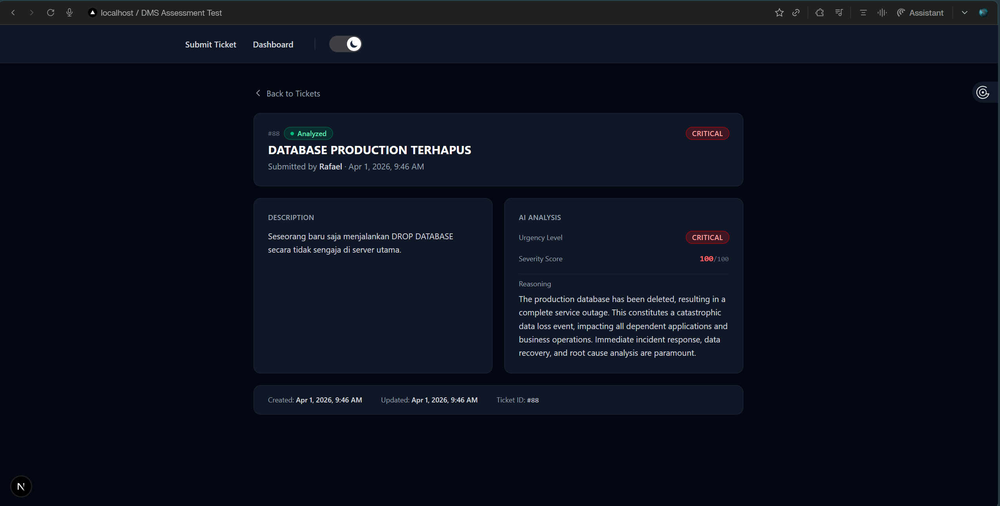

# Assessment Test DMS

## Demo Aplikasi dan workflow n8n









---

## Tech Stack

| Komponen | Tech Stack |
|----------|-----------|
| Backend API | FastAPI + Uvicorn |
| ORM | SQLAlchemy |
| Validasi Data | Pydantic v2 |
| Database | MySQL 8.0 (via Docker) |
| Automation / AI Pipeline | n8n |
| AI Model | Google Gemini 2.5 Flash |
| Frontend | Next.js 15 + TypeScript + Tailwind CSS |
| Containerization | Docker Compose |

---

## Panduan Setup

### Prerequisites
- [Docker](https://www.docker.com/products/docker-desktop/)
- Python 3.11+
- Node.js 18+ & package manager (`pnpm` atau `npm`)

---

### 1. Clone & Setup Environment Variables
Clone _repository_ ini ke local machine, lalu copy file `.env.example` ke file `.env` dan konfigurasi variabel yang diperlukan:

```bash
cp .env.example .env
```
*(Sesuaikan dan isi nilai kosong dengan kredensial yang valid)*.

```env
# Koneksi untuk SQLAlchemy
DATABASE_URL=mysql+pymysql://root:<MYSQL_ROOT_PASSWORD>@localhost:3307/ticket_db

# URL Webhook Trigger n8n
N8N_WEBHOOK_URL= (contoh: http://localhost:5679/webhook/testDMS)

# API gemini untuk n8n
GEMINI_API_KEY=(Gunakan API gemini dari https://aistudio.google.com)

# Origin URL frontend (untuk CORS di Backend)
URL_FRONTEND=http://localhost:3000
```

---

### 2. Setup Database & n8n via Docker
Buka terminal di direktori root project, lalu jalankan:

```bash
docker-compose up -d
```
Container akan menggunakan port lokal:
- Koneksi DB **MySQL** di port `3307` 
- Platform **n8n** di port `5679`

---

### 3. Setup Workflow n8n
1. Buka n8n di *browser* pada alamat `http://localhost:5679`.
2. Lakukan _Sign Up_ atau login.
3. Klik **Workflows > Import from File...**
4. Cari dan _Upload_ file `n8n/workflow.json`.
5. Nyalakan _toggle_ status menjadi **Publish** di kanan atas *workflow*.
6. Pastikan _Test URL_ dan _Production Webhook URL_ di Node pertama sesuai dengan `N8N_WEBHOOK_URL` di `.env`!

---

### 4. Setup Backend
Buka terminal baru lalu jalankan:

```bash
cd backend

# Buat virtual environment untuk python libraries
python -m venv .venv

# Aktifkan shell virtual environment:
# Windows (Powershell/Cmd):
.venv\Scripts\activate
# Mac/Linux (Bash/Zsh):
source .venv/bin/activate

# Install dependensi yang diperlukan
pip install -r requirement.txt

# Jalankan hot-reload server
uvicorn app.main:app --reload
```
Aplikasi backend akan berjalan di `http://localhost:8000`

---

### 5. Setup Frontend (Next.js React) 
Buka terminal baru lalu jalankan:

```bash
cd frontend

# untuk pnpm:
pnpm install
pnpm run dev

# untuk npm standar:
npm install
npm run dev
```

Aplikasi akan berjalan di `http://localhost:3000`.
